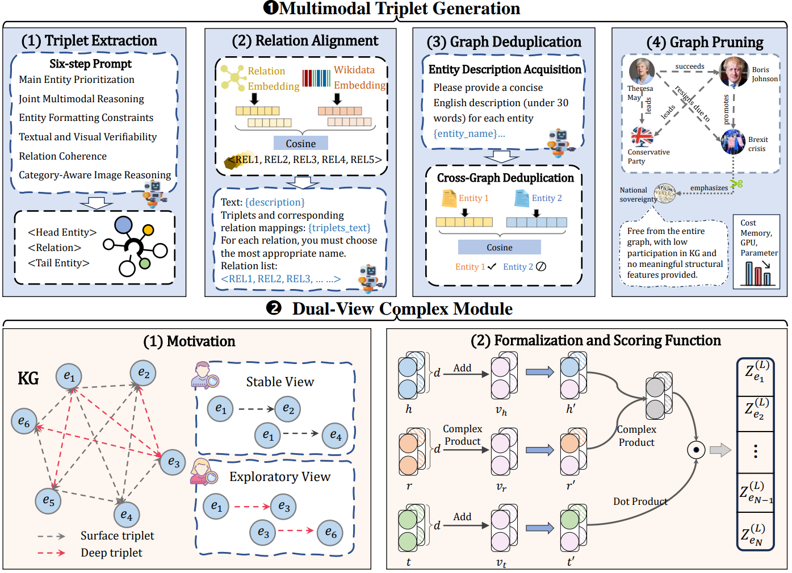

<h1 align="center">
  LLM-SE
</h1>

<h4 align="center">Beyond Embedding Fusion: LLM-Driven Structural Enhancement for Multimodal Knowledge Graph Completion</h4>

<h2 align="center">
  Overview of LLM-SE
  
</h2>


This repository includes the source code of the paper submitted to ACL 2026. 


### Dependencies

- Compatible with PyTorch 1.11.0 and Python 3.x.

### Dataset:

- We use three datasets for multimodal knowledge graph link prediction. 
- The preprocessed data are included in the `./data/processed/` directory.


### Results:
The results are:

| Dataset |  MRR  | Hits@1 | Hits@3 | Hits@10 |
| :-----: | :---: | :----: | :----: | :-----: |
|  MKG-W  | 0.477 | 0.405  | 0.519  |  0.607  |
|  MKG-Y  | 0.506 | 0.446  | 0.542  |  0.613  |
|  DB15K  | 0.476 | 0.403  | 0.516  |  0.611  |


### Training and testing:

- Install all the requirements from `./requirements.txt.`
- Commands for reproducing the reported results:

##### MKG-W

 ```shell
 python3 main.py -data_name MKG-W
                 -learning_rate 0.1
                 -epoch 100
                 -batch_size 1024
                 -emb_reg 0.1
                 -type_reg 0.0001
 ```

  ##### MKG-Y

  ```shell
 python3 main.py -data_name MKG-Y
                 -learning_rate 0.1
                 -epoch 60
                 -batch_size 1024
                 -emb_reg 0.05
                 -type_reg 0.0001
  ```

  ##### DB15K

  ```shell
 python3 main.py -data_name DB15K
                 -learning_rate 0.1
                 -epoch 100
                 -batch_size 1024
                 -emb_reg 0.01
                 -type_reg 0.0001
  ```

  - `-data_name` specifies the name of the dataset used for training and evaluation (e.g., DB15K).
  - `-learning_rate` sets the learning rate for model training.
  - `-epoch` sets the total number of training iterations.
  - `-batch_size` sets the number of samples per training batch.
  - `-emb_reg` sets the N3 regularization coefficient for embedding vectors.
  - `-type_reg` sets the regularization coefficient for view-related terms.

